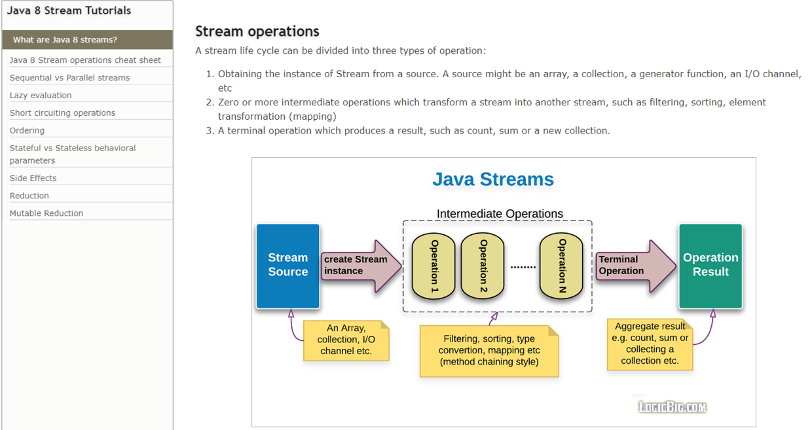
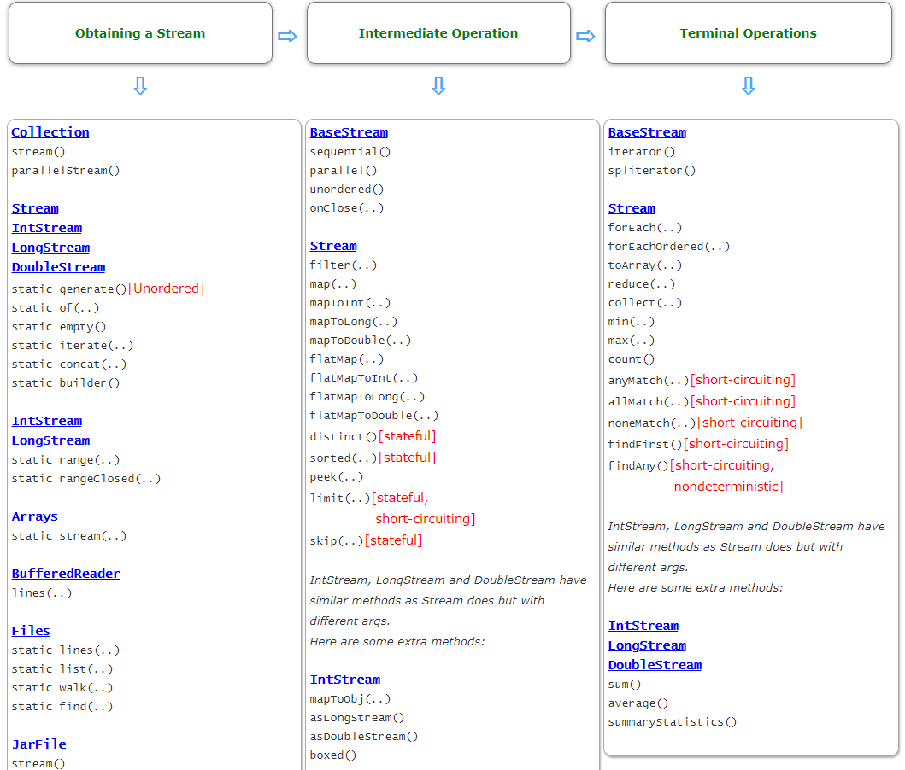

Java学习网站 [logicbig](https://www.logicbig.com/)



图片来自 [java 8 Stream Tutoriala](https://www.logicbig.com/tutorials/core-java-tutorial/java-util-stream/stream-api-intro.html)

如图 蓝色区域是流的创建，包括数组、文件、集合等；淡黄色区域是流的中间操作，包括过滤、排序、映射、扁平化等；绿色区域是流的终端操作，包括分组、收集、统计、归约等。



介绍下几个常用的函数接口
```
@FunctionalInterface
public interface Consumer<T> {
    void accept(T t);
    default Consumer<T> andThen(Consumer<? super T> after) {
        Objects.requireNonNull(after);
        return (T t) -> { accept(t); after.accept(t); };
    }
}
```
```
@FunctionalInterface
public interface Predicate<T> {

    boolean test(T t);

    default Predicate<T> and(Predicate<? super T> other) {
        Objects.requireNonNull(other);
        return (t) -> test(t) && other.test(t);
    }

    default Predicate<T> negate() {
        return (t) -> !test(t);
    }


    default Predicate<T> or(Predicate<? super T> other) {
        Objects.requireNonNull(other);
        return (t) -> test(t) || other.test(t);
    }

    static <T> Predicate<T> isEqual(Object targetRef) {
        return (null == targetRef)
                ? Objects::isNull
                : object -> targetRef.equals(object);
    }
}
```
```
@FunctionalInterface
public interface Supplier<T> {
    T get();
}

```
```
@FunctionalInterface
public interface Function<T, R> {
    R apply(T t);
    default <V> Function<V, R> compose(Function<? super V, ? extends T> before) {
        Objects.requireNonNull(before);
        return (V v) -> apply(before.apply(v));
    }
    default <V> Function<T, V> andThen(Function<? super R, ? extends V> after) {
        Objects.requireNonNull(after);
        return (T t) -> after.apply(apply(t));
    }
    static <T> Function<T, T> identity() {
        return t -> t;
    }
```


 `Predicate`的运用，可以组合条件筛选数据，可以去重等


```
public class Test {
    static Predicate<String>
            p1 = s -> s.contains("bar"),
            p2 = s -> s.length() < 5,
            p3 = s -> s.contains("foo"),
            p4 = p1.negate().and(p2).or(p3);

    public static void main(String[] args) {
        Stream.of("bar","foobar","barBaz").filter(p4).forEach(System.out::println); // 打印 foobar
    }
}
```
```
public class Test {
    static List<Bean> list = Lists.newArrayList(new Bean("a"),new Bean("a"),new Bean("c"));
    @Data
    static class Bean {
        @NonNull
        String name;
    }
    static <T> Predicate<T> distinct(Function<? super T,?> function) {
        Set<Object> set = new HashSet<>();
        return t -> set.add(function.apply(t));
    }
    public static void main(String[] args) {
        list.stream().filter(distinct(Bean::getName)).forEach(System.out::println);
    }
}
```
`Function` 的运用，如求正整数 n 的阶乘是所有小于或等于 n 的正整数的乘积`function(10) = 10 * 9 * 8 * 7 * 6 * 5 * 4 * 3 * 2 * 1`，斐波那契数列 `0、1、1、2、3、5、8、13、21、34`，柯里化等
```
public class Test {
    static Function<Integer, Integer> function;
    public static void main(String[] args) {
         function = n -> n == 0 ? 1 : n * function.apply(n - 1);
         IntStream.range(0,10).forEach(i -> System.out.println(function.apply(i)));
    }
}
```
```
public class Test {
    static Function<Integer, Integer> function;
    public static void main(String[] args) {
         function = n -> n == 0 ? 0 : n == 1 ? 1 : function.apply(n - 1) + function.apply(n - 2);
         IntStream.range(0,10).forEach(i -> System.out.println(function.apply(i)));
    }
}
```
```
public class Test {
    static Function<String, String> f1 = s -> s.toLowerCase(),
    f2 = s -> s.replaceAll("a","b"),f3 = f1.andThen(f2),f4= f1.compose(f2);
    public static void main(String[] args) {
        System.out.println(f3.apply("A")); // a
        System.out.println(f4.apply("A")); // b
    }
}
```
```
public class Test {
    static Function<String, Function<String,String>> f = a -> b -> a + b;
    public static void main(String[] args) {
        System.out.println(f.apply("hello").apply("java")); // hello java
    }
}
```
`Supplier` 的运用，如反射实例化对象
```
public class MySupplier<T> implements Supplier<T> {
    private Class<T> type;
    public MySupplier(Class<T> type) {
        this.type = type;
    }
    @Override
    @SneakyThrows
    public T get() {
        return type.newInstance();
    }

    public static <T> Supplier<T> newInstance(Class<T> type) {
        return new MySupplier<>(type);
    }

    public static void main(String[] args) {
       Bean bean = newInstance(Bean.class).get(); // 无参构造
    }
}
@Data
class Bean {
    String name;
}
```
```
public class Test implements Supplier<Integer>{
    private  int item;
    @Override
    public Integer get() {
        return item++ ;
    }
    public static void main(String[] args) {
        Stream.generate(new Test()).limit(10).forEach(System.out::println); // 0~9
    }
}
```
举一些比较冷门的例子
` merge`
```
public class Test {
    public static void main(String[] args) {
        HashMap<String,String> map = new HashMap<>();
        map.put("k","v");
        map.merge("k","v",(oldV,newV) -> oldV.concat(newV));
        map.entrySet().forEach(System.out::println);
    }
}
```
`reduce`
```
public class Test {
    public static void main(String[] args) {
        HashMap<String,String> map = new HashMap<>();
        map.put("k1","v1");
        map.put("k2","v2");
        String result = map.entrySet().stream().map(Map.Entry::getKey).reduce((k1,k2) -> k1.concat(k2)).get();
        System.out.println(result);
    }
}
```

`Collectors.mapping` 下游收集器，对姓名进行分组，然后收集`count`最大的数据

```
public class Test {
    public static void main(String[] args) {
        List<Bean> list = Lists.newArrayList(
                new Bean("a",100),
                new Bean("a",200),
                new Bean("c",200));
        Map<String, Optional<Integer>> map =  list
                .stream()
                .collect(Collectors.groupingBy(Bean::getName,
                        Collectors.mapping(Bean::getCount,Collectors.maxBy(
                        Comparator.comparing(Function.identity())))));
        System.out.println(map.get("a")); // 200
        System.out.println(map.get("c")); // 200
    }
    @Data
    static class Bean {
        @NonNull
        String name;
        @NonNull
        Integer count;
    }
}
```
`collectingAndThen` 下游收集器 ，对名字进行分组，然后收集最大的 `count` 数据，并取得最大的结果，
 `collectingAndThen` 是为了对分组的数据进一步处理，而 `Collectors.mapping` 和 `.map` 类似，是对数据的一种转换，映射，看下面第二个例子， `collectingAndThen`  和 `toMap` 类似，看下面第三个例子
```
public class Test {
    public static void main(String[] args) {
        List<Bean> list = Lists.newArrayList(
                new Bean("a",100),
                new Bean("a",200),
                new Bean("c",200));
        Map<String, Integer> map =  list
                .stream()
                .collect(Collectors.groupingBy(Bean::getName,
                        Collectors.collectingAndThen(Collectors.mapping(Bean::getCount,Collectors.maxBy(Comparator.comparing(Function.identity()))),Optional::get)));
        map.entrySet().forEach(System.out::println); // 打印 a=200 c=200
    }
    @Data
    static class Bean {
        @NonNull
        String name;
        @NonNull
        Integer count;
    }
}
```
结果和 `list.stream().map(Bean::getCount).collect(Collectors.toList());` 一样
```
public class Test {
    public static void main(String[] args) {
        List<Bean> list = Lists.newArrayList(
                new Bean("a",100),
                new Bean("a",200),
                new Bean("c",200));
        Collector<Bean,Integer,List<Integer>> collector = (Collector<Bean, Integer, List<Integer>>) Collectors.mapping(Bean::getCount,Collectors.toList());
        List<Integer> temp = list.stream().collect(collector);
        temp.forEach(System.out::println);
    }
    @Data
    static class Bean {
        @NonNull
        String name;
        @NonNull
        Integer count;
    }
}
```
```
public class Test {
    public static void main(String[] args) {
        List<Bean> list = Lists.newArrayList(
                new Bean("a",100),
                new Bean("a",200),
                new Bean("c",200));
      Map<String,Integer> map = list.stream().collect(Collectors.toMap(Bean::getName,Bean::getCount,Integer::max));
      map.entrySet().stream().forEach(System.out::println);
    }
    @Data
    static class Bean {
        @NonNull
        String name;
        @NonNull
        Integer count;
    }
}
```
`Collectors.partitioningBy` 条件分组，满足条件为 `true`，举个例子
```
public class Test {
    public static void main(String[] args) {
        List<Bean> list = Lists.newArrayList(
                new Bean("a",100),
                new Bean("a",200),
                new Bean("c",200));
      Map<Boolean, List<Bean>> map =
              list.stream().collect(Collectors.partitioningBy(bean -> bean.getCount() > 100,
                      Collectors.mapping(Function.identity(),Collectors.toList())));
    map.entrySet().stream().forEach(System.out::println);
    }
    @Data
    static class Bean {
        @NonNull
        String name;
        @NonNull
        Integer count;
    }
}
```
控制台打印
```
false=[Test.Bean(name=a, count=100)]
true=[Test.Bean(name=a, count=200), Test.Bean(name=c, count=200)]
```
`Collectors.reducing`  对名字进行分组，然后收集最大的 `count` 数据
```
public class Test {
    public static void main(String[] args) {
        List<Bean> list = Lists.newArrayList(
                new Bean("a",100),
                new Bean("a",200),
                new Bean("c",200));
        BinaryOperator<Integer> beanBinaryOperator = BinaryOperator.maxBy(Integer::compareTo);
            Map<String,Integer> map  =  list.stream().collect(Collectors.groupingBy(Bean::getName,Collectors.reducing(0,Bean::getCount,beanBinaryOperator)));
        map.entrySet().stream().forEach(System.out::println);
    }
    @Data
    static class Bean {
        @NonNull
        String name;
        @NonNull
        Integer count;
    }
}
```
打印
```
a=200
c=200
```


`Collector.of()`  看下部分源码，`supplier` 提供者`A`，一般是提供操作的容器，元素等工具，`accumulator` 是 `A` 对 `T` 元素进行一个操作，`combiner` 是`A`对 `T` 操作的结果进行一个合并，`finisher` 将 `A` 进行转换返回结果 `R`
```
public static<T, A, R> Collector<T, A, R> of(Supplier<A> supplier,
                                             BiConsumer<A, T> accumulator,
                                             BinaryOperator<A> combiner,
                                             Function<A, R> finisher
```
举个例子
```
public class Test {
    public static void main(String[] args) {
        List<Bean> list = Lists.newArrayList(
                new Bean("a",100),
                new Bean("a",200),
                new Bean("c",200));
        Collector<Bean,StringJoiner,String> collector = Collector.of(
                () -> new StringJoiner(","),
                (stringJoiner,bean) -> stringJoiner.add(bean.getName()),
                StringJoiner::merge,
                StringJoiner::toString
        );
        System.out.println(list.stream().collect(collector));
    }
    @Data
    static class Bean {
        @NonNull
        String name;
        @NonNull
        Integer count;
    }
}
```

参考

 [java-8-tutorial](https://winterbe.com/posts/2014/03/16/java-8-tutorial/)
[恕我直言：你可能真的不会java编程](https://www.kancloud.cn/hanxt/javacrazy/)
