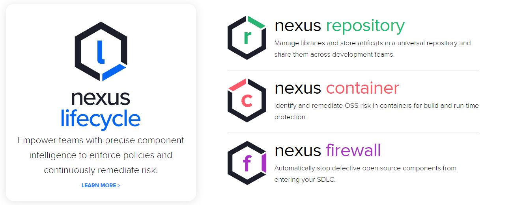
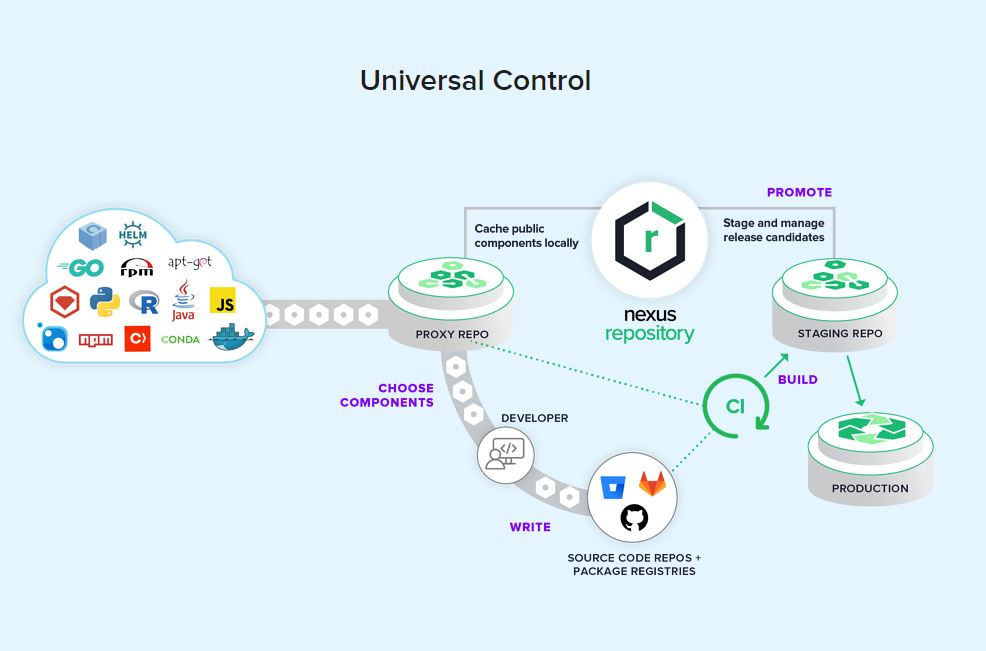
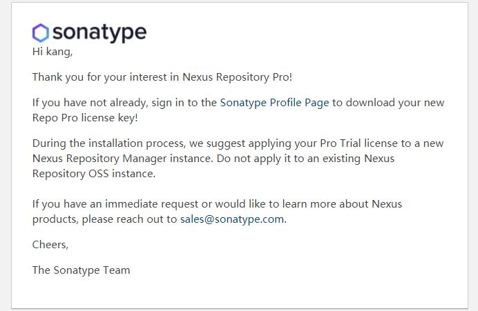
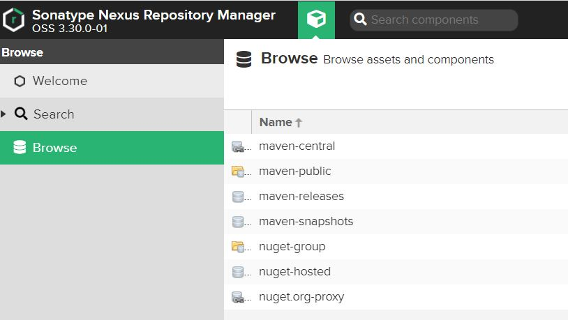
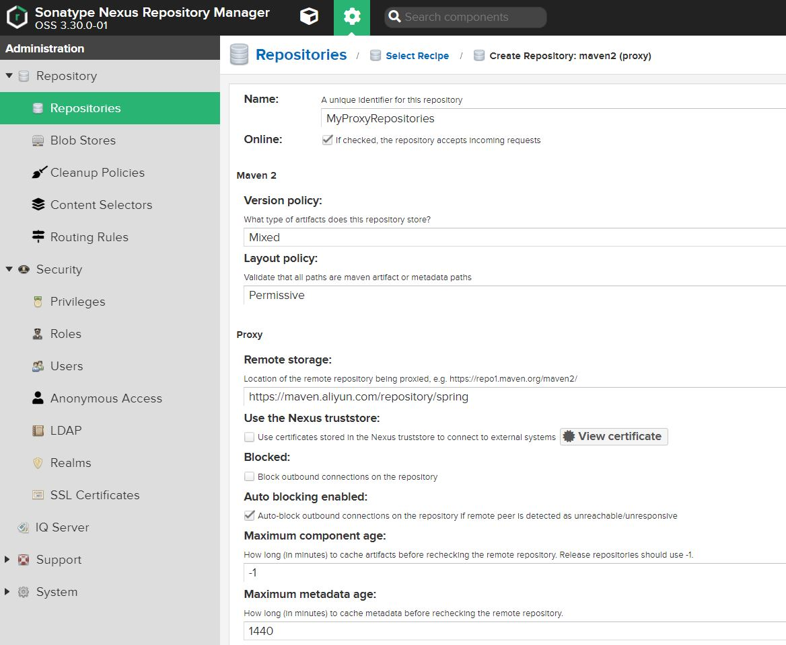
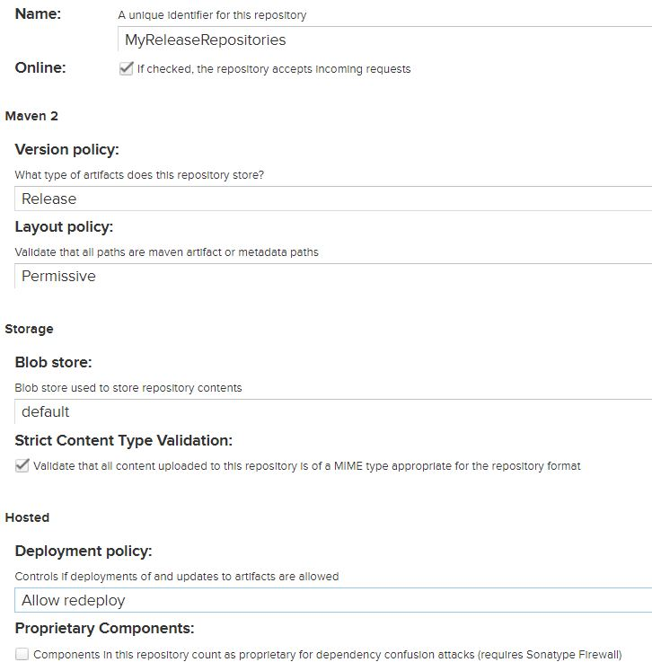
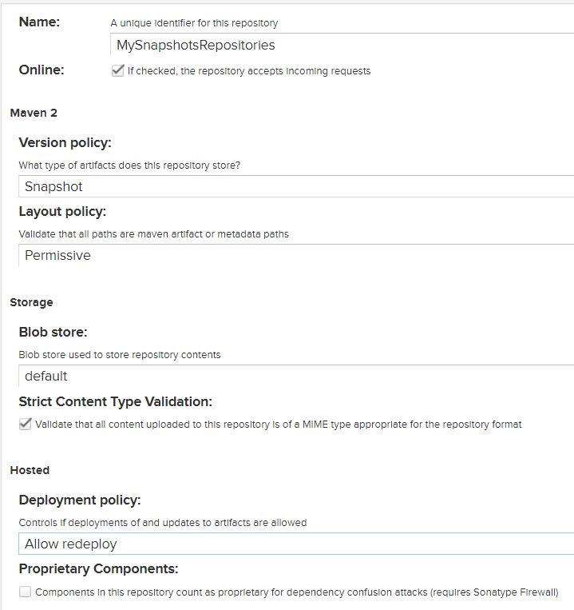

`nexus repository manager` ，`nexus `的 仓库管理

[图片链接](https://repo.eclipse.org/#welcome)

使用 `nexus ` 构建 `Maven` 私服，可以代理远程仓库和部署自己或第三方构件
gitHub 地址 [https://github.com/sonatype/nexus/releases](https://github.com/sonatype/nexus/releases)
官方地址 [https://www.sonatype.com/](https://www.sonatype.com/)


选择 `nexus repository` 查看 `repository` 构建架构

填写基本信息，邮件会收到验证信息，点击邮件内容的链接验证


点击 `Download: Nexus Repository` 下载，下载之后解压，有两个文件夹，`nexus-3.30.0-01`文件夹 是 `web` 服务器 ，` sonatype-work` 文件夹是私有仓库的目录，新建一个文件夹 `nexus ` ，把这两个文件夹移动里面，进入  `\nexus\nexus-3.30.0-01\bin` 打开 `CMD` 窗口，运行 `nexus /run`

运行完后 打开 `http://localhost:8081/`

`Browse` 默认生成的仓库，
| type    |  介绍   |备注|
| --- | --- | ---|
|   proxy  |  代理仓库   |中央仓库的私有仓库|
| hosted | 本地开发的项目|releases 稳定版本仓库、snapshots 快照版本仓库|

点击右上角登录

复制 `admin.password` 的默认密码，默认账号是 `admin`，登录之后创建代理仓库

选择 `maven2 （proxy）`


`Version policy` 有三个选项 
|  type   | 说明    |
| --- | --- |
|   Mixed  |   混合  |
|   Release|   发布|
|   Snapshot|   快照  |
`Layout policy` 有二个选项 
|  type   | 说明    |
| --- | --- |
|   Strict|   严格模式|
|   Permissive|   授权模式|
`Remote storage` 填写 远程镜像仓库，`https://maven.aliyun.com/nexus/content/groups/public/`，[阿里云Maven](https://maven.aliyun.com/mvn/guide)
创建成功看到状态为在线等待连接

接下来创建发布仓库和快照仓库
`Deployment policy` 有三个选项 
|  type   | 说明    |
| --- | --- |
|   Allow redeploy|   允许重复发布  |
|   Disabled redeploy|   禁止发布|
|   Read-only|   只读  |


配置代理仓库、快照仓库、发布仓库后，打开`maven`配置文件 `settings.xml`文件配置连接仓库的账号和密码，发布稳定版本和快照版本是需要连接`Nexus`，配置的是授权模式
```

 <servers>
	<server>  
	  <id>MyReleaseRepositories</id> 
	  <username>admin</username>  
	  <password>admin</password>  
	</server>  

	<server>  
	  <id>MySnapshotsRepositories</id> 
	  <username>admin</username>  
	  <password>admin</password>  
	</server>  

  </servers>
```
新建一个 `maven`工程，配置 `pom.xml`，`url` `copy`

```
    <groupId>org.example</groupId>
    <artifactId>MyNexus</artifactId>
    <version>1.0-SNAPSHOT</version>

    <parent>
        <groupId>org.springframework.boot</groupId>
        <artifactId>spring-boot-starter-parent</artifactId>
        <version>2.2.1.RELEASE</version>
    </parent>

    <dependencies>
        <dependency>
            <groupId>org.springframework.boot</groupId>
            <artifactId>spring-boot-starter-web</artifactId>
        </dependency>
    </dependencies>
    <build>
        <plugins>
            <plugin>
                <groupId>org.springframework.boot</groupId>
                <artifactId>spring-boot-maven-plugin</artifactId>
            </plugin>
        </plugins>
    </build>
    <repositories>
        <!--    设置代理仓库   -->
        <repository>
            <id>MyProxyRepositories</id>
            <name>MyProxyRepositories</name>
            <url>http://localhost:8081/repository/MyProxyRepositories/</url>
            <releases><enabled>true</enabled></releases>
            <snapshots><enabled>true</enabled></snapshots>
        </repository>
    </repositories>
    <distributionManagement>
        <!--   设置稳定版本发布仓库    -->
        <repository>
            <id>MyReleaseRepositories</id>
            <name>MyReleaseRepositories</name>
            <url>http://localhost:8081/repository/MyReleaseRepositories/</url>
        </repository>
        <!--   设置快照版本发布仓库    -->
        <snapshotRepository>
            <id>MySnapshotsRepositories</id>
            <name>MySnapshotsRepositories</name>
            <url>http://localhost:8081/repository/MySnapshotsRepositories/</url>
        </snapshotRepository>
    </distributionManagement>
```

修改 `pom `文件 的`<version>1.0-SNAPSHOT</version>` 改成
  `<version>1.0-RELEASE</version>`，执行命令 `mvn deploy`
查看`Browse`，稳定版本已经发布上去了

`Maven & Nexus` 使用参考 [https://www.sonatype.com/resources/ebooks](https://www.sonatype.com/resources/ebooks)
参考 [Maven-组织内部项目统一配置DistributionManagement](https://galaxyyao.github.io/2019/09/18/Maven-%E7%BB%84%E7%BB%87%E5%86%85%E9%83%A8%E9%A1%B9%E7%9B%AE%E7%BB%9F%E4%B8%80%E9%85%8D%E7%BD%AEDistributionManagement/)
[聊聊项目打包发布到maven私仓常见的几种方式](https://cloud.tencent.com/developer/article/1799571)
[nexus私服 和 settings.xml](https://juejin.cn/post/6844904104032993293#heading-3)


